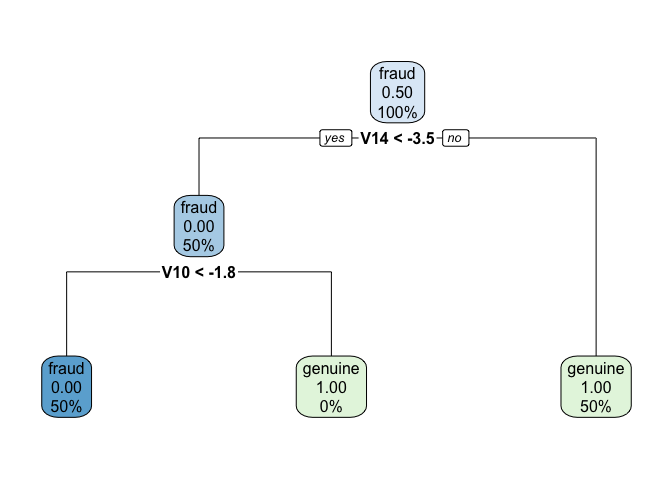
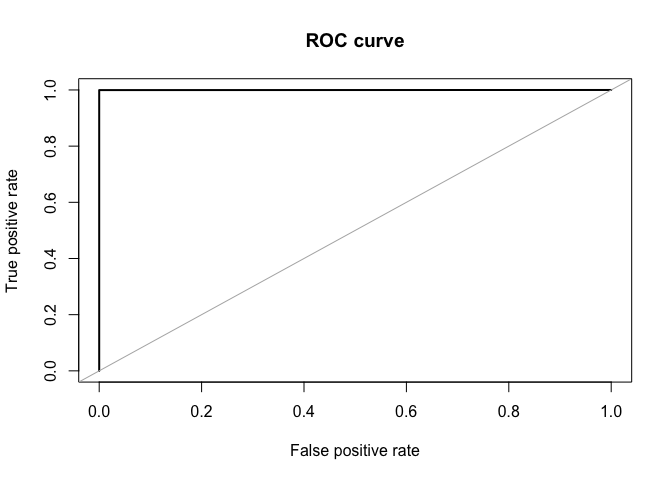

Kaggle’s Credit Card Fraud Detection Analysis
================
Fan Kiat Chan (<fchan5@illinois.edu>)
May 5, 2021

------------------------------------------------------------------------

## Abstract

The goal of this analysis is to use available data for creating a
detection tool for credit card frauds. Data was first transformed to
remedy the issue of data imbalance. Different modeling approaches are
then explored, compared and analyzed. The results show good accuracies
on training dataset for the different models, where further evaluation
performed on the test data using the simplest model (decision tree)
present accurate predictions as well.

------------------------------------------------------------------------

## Introduction

This analysis attempts to seek a reasonable model using available data
for detecting credit card fraud. Since countless transactions happen
over credit card payments daily, it is important that credit card
companies are able to keep track of these transactions and to recognize
fraudulent activities quickly so that customers are not charged for
items they did not purchase. We note here that this is an exercise, and
the models and results presented here are not, under any circumstances,
a conclusive claim on the existence of a fraudulent activity. Please
consult your credit card representative if you suspect any fraudulent
activity on your credit statements.

------------------------------------------------------------------------

## Methods

Here we describe the data used and how it is processed before fitting to
a few models for analysis.

### Data

We will be using the [Kaggle Credit Card Fraud
Detection](https://www.kaggle.com/mlg-ulb/creditcardfraud) for our
analysis. The data can be downloaded using the `make-data.R` script,
which will create the data file in `data/cc-sub.csv`. We can then load
and take a quick look at the data.

``` r
# cc_sub = read_csv("data/cc-sub.csv", col_types = cols())
cc_sub = data.table::fread("data/cc-sub.csv")
cc_sub
```

    ##          Time         V1         V2         V3          V4         V5
    ##     1:  49821 -0.7502343  1.1754267  1.5595377 -0.20901999  0.1305026
    ##     2:  46444 -0.8175723  0.8090505  1.3290570 -0.01947022  1.3056713
    ##     3:  67173  1.2369726 -1.5216076  1.2869277 -0.95645464 -2.3059195
    ##     4:  55536 -2.7006726  2.1654046  0.4472568 -2.07782098  0.1870938
    ##     5:  42684  1.2113732 -1.5246436  0.9208605 -1.20729584 -2.0739754
    ##    ---                                                               
    ##  9996:  61051 -1.2525435  1.0220124  0.5251504 -0.56492036  0.6464132
    ##  9997:  32841  0.9061640 -0.5947690  0.2442484  0.30937172 -0.6338624
    ##  9998:  79261 -0.7874341  0.0137707  0.5713829 -1.20272439  2.5241505
    ##  9999:  67924 -3.0188332  2.6153743 -0.1888622 -1.64826978 -1.4099864
    ## 10000: 136507 -0.5122868  1.7329647 -1.2663120  0.89064754  1.3777953
    ##                 V6          V7          V8         V9         V10        V11
    ##     1: -0.22858583  0.56432193  0.16495107 -0.6191044  0.09696998  1.8830536
    ##     2:  0.58299576  0.75268701  0.18783551 -0.2774520 -0.87979303 -2.0151494
    ##     3: -0.49560395 -1.35705000 -0.08168125 -1.2188844  1.17585343 -0.4222531
    ##     4: -0.13838152  0.64005888 -0.04288687  2.0535139  2.34377759 -0.9163488
    ##     5: -0.61841693 -1.18424475 -0.14905043 -1.5947624  1.31431634 -0.3816140
    ##    ---                                                                      
    ##  9996: -0.72452348  0.60714361 -0.07242965  0.3668586  0.09703237 -1.1874643
    ##  9997: -0.40825821  0.07974332 -0.07487963  0.4175003 -0.34764001 -0.2575897
    ##  9998:  3.78208266 -0.30891778  1.11395238  0.2860203 -0.93373542 -1.0369514
    ##  9999: -1.03714935 -0.54871202  1.28222264  1.0596345  1.43221198  0.9442085
    ## 10000: -0.06618127  1.10909979  0.37227377 -1.1845634 -0.70705053  0.5358593
    ##                V12         V13        V14         V15          V16        V17
    ##     1:  1.29273462  0.81298241  0.1257637  0.29977034 -0.021054714 -0.3527599
    ##     2: -0.28605876 -0.07643541 -0.1475853 -0.54430891 -0.180988817 -0.4423960
    ##     3: -0.00390446  1.40589412 -1.1201284 -0.35567366 -0.613503392  0.7931381
    ##     4: -0.56564127 -0.30329831 -0.9441307  1.07200030  0.306013405 -0.9664395
    ##     5: -0.49234387  1.35234990 -0.7008821  0.88761261 -0.011330668  0.2815917
    ##    ---                                                                       
    ##  9996: -0.68384545 -0.37954830 -0.6331506  0.70416090  0.895012273 -0.6327523
    ##  9997:  0.38351633 -0.13570512  0.1175000  0.58121325 -0.300242624  0.2493190
    ##  9998:  0.08190668 -0.40281173 -0.4400227 -1.34030088 -0.009060249 -0.4904616
    ##  9999:  0.70975631 -0.68856026  0.4142456 -0.06609962  0.969100806 -0.5975988
    ## 10000:  0.41477908  0.01903447 -0.5993131 -0.85733695 -0.261046801  1.0635633
    ##                V18        V19         V20         V21         V22          V23
    ##     1: -0.50262966 -0.1670631  0.25068257 -0.15652721 -0.27780351  0.013860758
    ##     2: -0.41488086 -0.2973392 -0.10449596 -0.13446754 -0.28337663 -0.524480491
    ##     3: -0.16073095 -0.2434950 -0.08082593 -0.14875888 -0.03503285  0.006537145
    ##     4: -0.60496699 -0.8814594  1.05272138 -0.46113097 -0.39213953 -0.069874194
    ##     5:  0.25941315 -0.5000438  0.01670652 -0.04986005 -0.03021285 -0.044589269
    ##    ---                                                                        
    ##  9996:  0.11012899 -0.4238053  0.03437198 -0.41944280 -0.94881885 -0.340480862
    ##  9997: -1.18652519 -0.1081520  0.21429222 -0.13698461 -0.63993744 -0.031261488
    ##  9998: -0.04737498  0.1650742  0.05985796 -0.08227584 -0.23644363 -0.235870754
    ##  9999:  0.17511220 -0.6854479  0.65414746 -0.25432338 -0.32730642  0.159148896
    ## 10000:  0.98604899  0.9901229  0.12426469  0.10937486  0.42593285 -0.229961527
    ##               V24         V25         V26         V27         V28 Amount
    ##     1:  0.2270712 -0.24285157  0.07259492  0.39408861  0.17045223   2.69
    ##     2: -1.3194238  0.85998957 -0.30496241  0.05103634  0.04562376   1.00
    ##     3:  0.7323922  0.20138648 -0.22924808  0.06730078  0.05539532 113.00
    ##     4: -0.9460008  0.05293397  0.74441736  0.24013057 -0.08615924   1.54
    ##     5:  0.3969473  0.14270095 -0.23778073  0.04236292  0.06003009 152.65
    ##    ---                                                                  
    ##  9996: -0.6443000 -0.14224476 -0.07192081 -0.27333488 -0.47288965   8.90
    ##  9997:  0.1439551  0.09538280  0.86590943 -0.09074610  0.03002850 171.73
    ##  9998:  1.0511155  0.33039181  0.28346581  0.05944422  0.09966676  12.70
    ##  9999:  0.3167349  0.06727674  0.66424222 -0.09032630 -0.44434268   0.75
    ## 10000:  0.1117488  0.12211142 -0.39705395  0.31553118  0.20898132  38.34
    ##          Class
    ##     1: genuine
    ##     2: genuine
    ##     3: genuine
    ##     4: genuine
    ##     5: genuine
    ##    ---        
    ##  9996: genuine
    ##  9997: genuine
    ##  9998: genuine
    ##  9999: genuine
    ## 10000: genuine

We can see that the data is stored as a tibble of size 10,000 x 31. Each
row of the tibble contains a sample data for an individual, each with 31
features represented by the columns. The meanings of each feature are as
below:

-   `V1`, `V2`, … `V28` - the principal components obtained with PCA
    (original features and background information about the data is not
    provided due to confidentiality issues)
-   `Time` - seconds elapsed between each transaction and the first
    transaction in the dataset
-   `Amount` - transaction amount
-   `Class` - transaction label either as `fraud` (positive) or
    `genuine` (negative)

We then perform test-train split on the data and check for any missing
values in the training data.

``` r
# test-train split the data
set.seed(42)
trn_idx = createDataPartition(cc_sub$Class, p = 0.80, list = FALSE)
cc_trn = cc_sub[trn_idx, ]
cc_tst = cc_sub[-trn_idx, ]

# function to determine proportion of NAs in a vector
na_prop = function(x) {
  mean(is.na(x))
}

# check proportion of NAs in each column
sapply(cc_trn, na_prop)
```

    ##   Time     V1     V2     V3     V4     V5     V6     V7     V8     V9    V10 
    ##      0      0      0      0      0      0      0      0      0      0      0 
    ##    V11    V12    V13    V14    V15    V16    V17    V18    V19    V20    V21 
    ##      0      0      0      0      0      0      0      0      0      0      0 
    ##    V22    V23    V24    V25    V26    V27    V28 Amount  Class 
    ##      0      0      0      0      0      0      0      0      0

Fortunately, we do not see any missing data. We need to further coerce
the `Class` response variable as factors so as to facilitate the
classification modeling later.

Taking a quick look at the training data, we quickly realize that the
dataset is extremely unbalanced.

``` r
prop.table(table(cc_trn$Class))
```

    ## 
    ##   fraud genuine 
    ##  0.0015  0.9985

Considering the proportions of the data classified as `fraud`, using a
classifier that always detect no fraudulent activity would be 99.85%
accurate. This indicates that the sensitivity to false negative is low,
and signals that mean accuracy is not a good measure for the performance
of the developed model. Instead we could look at other measures such as
sensitivity and specificity as well as measuring the area under the
receiver operating characteristic (ROC) curve.

To remedy this, we can transform the data and create samples via random
sampling to possibly balance the data set. Here we use over-sampling
minority (`fraud`) data to generate a sampled data that is balanced.

``` r
set.seed(42)
cc_trn_sampled = ovun.sample(
  Class ~ .,
  data = cc_trn,
  method = "over",
  N = length(cc_trn$Class) * 2)$data
cc_trn_sampled$Class <- relevel(cc_trn_sampled$Class, "fraud")
# Check data proportion now
prop.table(table(cc_trn_sampled$Class))
```

    ## 
    ##   fraud genuine 
    ## 0.50075 0.49925

The data now looks more balanced. We can further look into the
correlations between different feature variables and response variable.

``` r
cc_corr_viz = cc_trn_sampled
cc_corr_viz$Class = ifelse(cc_corr_viz$Class == "genuine", 1, 0)
corr_plot = corrplot(cor(cc_corr_viz[,-1]), method = "circle", type = "upper")
```


Looking at the correlations between `Class` and other feature variables,
we see that there is a strong correlation with `V14`, `V12`, `V10` and
`V9`. We should keep an eye on these variables later when we look at the
models.

### Modeling

In our modeling, we will be using the 5-fold cross-validation approach
for

-   decision tree
-   k-nearest neigbours
-   random forest

``` r
# cross-validation with decision tree, knn and random forest
cv_5 = trainControl(method = "cv",
                    number = 5,
                    )

# try with decision tree
cc_tree_mod = train(
  form = Class ~ .,
  data = cc_trn_sampled,
  method = "rpart",
  trControl = cv_5,
  tuneLength = 5
)

# try with knn
cc_knn_mod = train(
  form = Class ~ .,
  data = cc_trn_sampled,
  method = "knn",
  trControl = cv_5,
  tuneLength = 5
)

# try with random forest
cc_rf_mod = train(
  form = Class ~ .,
  data = cc_trn_sampled,
  method = "rf",
  trControl = cv_5,
  tuneLength = 5,
  verbose = FALSE
)
```

For brevity, we include final best model settings for each of these
approaches in the appendix. Instead, we focus next on some metrics for
evaluating the performance of these models, where we first compare the
accuracies and the confusion matrices for these models.

------------------------------------------------------------------------

## Results

Looking at the confusion matrices, we see that overall the models
perform well, with knn showing some false positive predictions.

``` r
confusionMatrix(cc_tree_mod)
```

    ## Cross-Validated (5 fold) Confusion Matrix 
    ## 
    ## (entries are percentual average cell counts across resamples)
    ##  
    ##           Reference
    ## Prediction fraud genuine
    ##    fraud    50.1     0.0
    ##    genuine   0.0    49.9
    ##                             
    ##  Accuracy (average) : 0.9998

``` r
confusionMatrix(cc_knn_mod)
```

    ## Cross-Validated (5 fold) Confusion Matrix 
    ## 
    ## (entries are percentual average cell counts across resamples)
    ##  
    ##           Reference
    ## Prediction fraud genuine
    ##    fraud    50.1     0.5
    ##    genuine   0.0    49.4
    ##                             
    ##  Accuracy (average) : 0.9949

``` r
confusionMatrix(cc_rf_mod)
```

    ## Cross-Validated (5 fold) Confusion Matrix 
    ## 
    ## (entries are percentual average cell counts across resamples)
    ##  
    ##           Reference
    ## Prediction fraud genuine
    ##    fraud    50.1     0.0
    ##    genuine   0.0    49.9
    ##                             
    ##  Accuracy (average) : 0.9999

When looking at the ROC curves, we see that the area under the curve is
close to 1 for all of these models.

``` r
pred_tree = predict(cc_tree_mod, cc_trn_sampled, method = "class")
pred_knn = predict(cc_knn_mod, cc_trn_sampled, method = "class")
pred_rf = predict(cc_rf_mod, cc_trn_sampled, method = "class")

roc.curve(cc_trn_sampled$Class, pred_tree, plotit = TRUE)
```


    ## Area under the curve (AUC): 1.000

``` r
roc.curve(cc_trn_sampled$Class, pred_knn, plotit = TRUE)
```


    ## Area under the curve (AUC): 0.998

``` r
roc.curve(cc_trn_sampled$Class, pred_rf, plotit = TRUE)
```


    ## Area under the curve (AUC): 1.000

------------------------------------------------------------------------

## Discussion

Considering the similar performance of these models, we pick the
decision tree model as our best model for testing. This is motivated by
the simplicity of the model. It takes much less time to train and also
prove to be simple to use by just following the flow of the decision
tree chart as below.



We further highlight the decision tree looks at two features: `V14` and
`V10`, which is consistent with the observation of strong correlations
between these features and the response variable `Class` as shown in the
chart before.

Further evaluation of the decision tree model on a few other metrics
(sensitivity, specificity, etc.) and ROC curve using the testing data
shows the following results.

``` r
# test accuracy
pred_tst = predict(cc_tree_mod, cc_tst, method = "class")
roc.curve(cc_tst$Class, pred_tst, plotit = TRUE)
```



    ## Area under the curve (AUC): 1.000

``` r
confusionMatrix(data = pred_tst, reference = cc_tst$Class)
```

    ## Confusion Matrix and Statistics
    ## 
    ##           Reference
    ## Prediction fraud genuine
    ##    fraud       3       1
    ##    genuine     0    1996
    ##                                      
    ##                Accuracy : 0.9995     
    ##                  95% CI : (0.9972, 1)
    ##     No Information Rate : 0.9985     
    ##     P-Value [Acc > NIR] : 0.1989     
    ##                                      
    ##                   Kappa : 0.8569     
    ##                                      
    ##  Mcnemar's Test P-Value : 1.0000     
    ##                                      
    ##             Sensitivity : 1.0000     
    ##             Specificity : 0.9995     
    ##          Pos Pred Value : 0.7500     
    ##          Neg Pred Value : 1.0000     
    ##              Prevalence : 0.0015     
    ##          Detection Rate : 0.0015     
    ##    Detection Prevalence : 0.0020     
    ##       Balanced Accuracy : 0.9997     
    ##                                      
    ##        'Positive' Class : fraud      
    ## 

As we can see from the ROC curve, the area under the curve is 1. The
sensitivity is 1.0, which indicate that the model correctly predicts all
existing frauds in the testing dataset. A disclaimer here though is that
the samples marked as `fraud` (positive class) is extremely low due to
sample imbalance. The specificity is 0.9995, which is still quite good,
since detecting `genuine` activity as `fraud` (at a very low rate too!)
is most likely acceptable, since it is better to be safe than sorry.

Overall, we have presented a few models that could be use to detect
credit card frauds with good accuracy given the available unbalanced
dataset, with decision tree chosen as our desired model given its
simplicity in training and deployment. Future improvements that can be
incorporated in the model development include taking a deeper look into
feature variables that show strong correlations with response variable
as highlighted above, and perhaps consult a financial professional for
deciding which model, given the limitations, better augments the
fraudulent detection pipeline. More balanced data set should also be
used for fitting these models.

------------------------------------------------------------------------

## Appendix

Below we show the optimal settings for each model used.

``` r
cc_tree_mod
```

    ## CART 
    ## 
    ## 16000 samples
    ##    30 predictor
    ##     2 classes: 'fraud', 'genuine' 
    ## 
    ## No pre-processing
    ## Resampling: Cross-Validated (5 fold) 
    ## Summary of sample sizes: 12799, 12801, 12800, 12800, 12800 
    ## Resampling results across tuning parameters:
    ## 
    ##   cp         Accuracy   Kappa    
    ##   0.0000000  0.9998125  0.9996250
    ##   0.2493741  0.9986875  0.9973751
    ##   0.4987481  0.9986875  0.9973751
    ##   0.7481222  0.9986875  0.9973751
    ##   0.9974962  0.6996875  0.3983750
    ## 
    ## Accuracy was used to select the optimal model using the largest value.
    ## The final value used for the model was cp = 0.

``` r
cc_knn_mod
```

    ## k-Nearest Neighbors 
    ## 
    ## 16000 samples
    ##    30 predictor
    ##     2 classes: 'fraud', 'genuine' 
    ## 
    ## No pre-processing
    ## Resampling: Cross-Validated (5 fold) 
    ## Summary of sample sizes: 12800, 12801, 12800, 12800, 12799 
    ## Resampling results across tuning parameters:
    ## 
    ##   k   Accuracy   Kappa    
    ##    5  0.9948750  0.9897498
    ##    7  0.9932500  0.9864996
    ##    9  0.9911250  0.9822495
    ##   11  0.9891251  0.9782493
    ##   13  0.9874376  0.9748741
    ## 
    ## Accuracy was used to select the optimal model using the largest value.
    ## The final value used for the model was k = 5.

``` r
cc_rf_mod
```

    ## Random Forest 
    ## 
    ## 16000 samples
    ##    30 predictor
    ##     2 classes: 'fraud', 'genuine' 
    ## 
    ## No pre-processing
    ## Resampling: Cross-Validated (5 fold) 
    ## Summary of sample sizes: 12800, 12799, 12801, 12800, 12800 
    ## Resampling results across tuning parameters:
    ## 
    ##   mtry  Accuracy   Kappa   
    ##    2    0.9999375  0.999875
    ##    9    0.9998750  0.999750
    ##   16    0.9996875  0.999375
    ##   23    0.9996875  0.999375
    ##   30    0.9996875  0.999375
    ## 
    ## Accuracy was used to select the optimal model using the largest value.
    ## The final value used for the model was mtry = 2.
